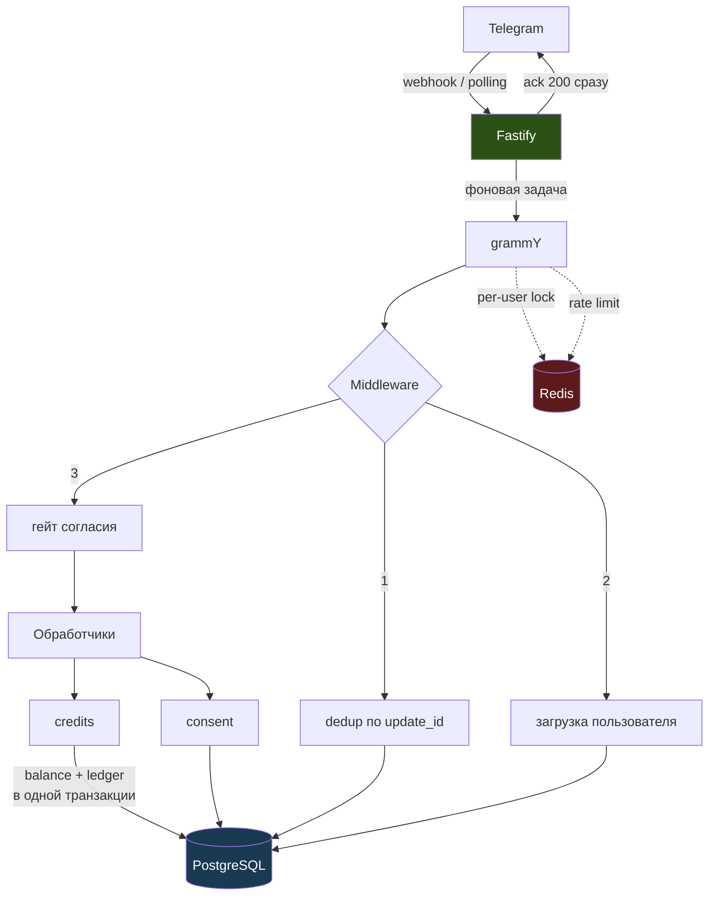

# Luma

Telegram-бот с AI-компаньоном. Прозрачный AI-персонаж: пользователь узнаёт, что это программа,
до первого содержательного диалога и до любой оплаты.

Продукт продаёт **только явные цифровые услуги** (пакеты сообщений). Персонаж никогда не просит
денег для себя, не имитирует человека и не давит на одиночество — эти запреты зашиты и в system
prompt, и в серверные правила.

**Статус:** Phase 1 завершена (фундамент, схема БД, disclosure, trial-кредиты).
План — `docs/` и `.claude/plans/`.

## Документы

| Файл | О чём |
|---|---|
| [docs/pricing.md](docs/pricing.md) | Экономика: себестоимость реплики, цены SKU, точка безубыточности, cost cap |
| [docs/decisions.md](docs/decisions.md) | 15 технических решений с обоснованиями |

Начните с `pricing.md`: он объясняет, почему дефолтная модель — `gemini-2.5-flash-lite`,
а не `gemini-2.5-flash`.

## Архитектура



Ключевые инварианты:

- **Webhook отвечает 200 немедленно**, обработка уходит в фон. Требование ТЗ «ack < 2 s»
  несовместимо с синхронной генерацией ответа.
- **Баланс меняется только вместе с записью в ledger**, в одной транзакции.
- **Дедупликация updates — в Postgres**, не в Redis: Redis не переживает рестарт, а дубликат
  означал бы двойное списание.
- **Кредит списывается только после успешного ответа.** Ошибки LLM и отказы модерации не платные.

## Требования

Node 24+, Docker (для локальных Postgres и Redis).

## Быстрый старт

```bash
npm install
```

Поднять зависимости (Postgres на 5434, Redis на 6381 — 5432/5433/6379/6380 обычно заняты):

```bash
docker compose up -d
```

Создать `.env` из шаблона:

```bash
cp .env.example .env
```

Сгенерировать ключ шифрования содержимого и вписать его в `CONTENT_ENCRYPTION_KEY`:

```bash
node -e "console.log(require('crypto').randomBytes(32).toString('base64'))"
```

Заполнить `TELEGRAM_BOT_TOKEN` (у [@BotFather](https://t.me/BotFather)) и `GEMINI_API_KEY`
([AI Studio](https://aistudio.google.com/apikey)). Применить миграции и запустить:

```bash
npx prisma migrate deploy
```

```bash
npm run dev
```

Локально бот работает в режиме long polling — публичный HTTPS и ngrok не нужны.

## Команды

| Команда | Действие |
|---|---|
| `npm run dev` | Запуск с автоперезагрузкой |
| `npm test` | Тесты (поднимают отдельную БД `luma_test`) |
| `npm run typecheck` | Проверка типов |
| `npm run lint` | ESLint |
| `npm run db:migrate` | Создать и применить миграцию |
| `npm run db:studio` | Prisma Studio |

## Прод

`TELEGRAM_MODE=webhook` плюс `TELEGRAM_WEBHOOK_URL` и `TELEGRAM_WEBHOOK_SECRET` (≥32 символов,
`openssl rand -hex 32`). Приложение само зарегистрирует webhook при старте и будет отклонять
запросы с неверным secret token.

Валидация окружения строгая: при webhook-режиме без секрета приложение не стартует.

Заводите **отдельного бота для staging** — общий токен между средами приводит к тому, что
тестовые сообщения уходят реальным пользователям.

## Модель угроз (кратко)

- Содержимое сообщений и память шифруются AES-256-GCM. Ключ живёт в env рядом с приложением:
  это защищает от утечки дампа БД, но **не** от компрометации сервера.
- Кастомизация персонажа не принимает свободный текст — только enum'ы и теги из каталога.
  Свободное поле здесь равнялось бы prompt injection в system prompt.
- Payload платежей не логируется, хранится только SHA-256.
- Токены и ключи вырезаются из логов на уровне pino redact.

Полная версия появится в `docs/threat-model.md` в Phase 5.
